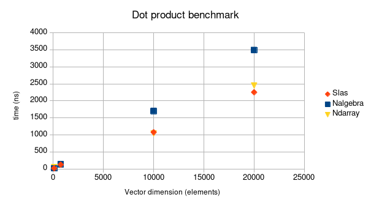

# How to replicate
You can test and benchmark slas on your local machine by running
`cargo test -p tests` and `cargo bench -p tests`
respectively, in the repository root.

If you want to compare performance of slas, [ndarray](https://lib.rs/ndarray) and [nalgebra](https://nalgebra.org) you can run 

`cargo bench -j8 -p tests --features tests/versus`


# Dot product benchmarks
All benchmarks are for 32-bit real floats using blis as a blas provider.
Allocations are not being benchmarked, only the actual dot product function. 
Benchmarks have been run for vectors of multiple different sizes, the most relevant results are shown bellow.


*Lower points are better*

## 100
```
test versus::nalgebra::dot     ... bench:          18 ns/iter (+/- 2)
test versus::ndarray::dot      ... bench:          53 ns/iter (+/- 8)
test versus::slas::dot_blas    ... bench:          52 ns/iter (+/- 8)
test versus::slas::dot_default ... bench:          19 ns/iter (+/- 3)
test versus::slas::dot_rust    ... bench:          19 ns/iter (+/- 2)
```

## 750
```
test versus::nalgebra::dot     ... bench:         136 ns/iter (+/- 26)
test versus::ndarray::dot      ... bench:         128 ns/iter (+/- 14)
test versus::slas::dot_blas    ... bench:         126 ns/iter (+/- 20)
test versus::slas::dot_default ... bench:         126 ns/iter (+/- 16)
test versus::slas::dot_rust    ... bench:         230 ns/iter (+/- 29)
```

## 10000
```
test versus::nalgebra::dot     ... bench:       1,700 ns/iter (+/- 305)
test versus::ndarray::dot      ... bench:       1,044 ns/iter (+/- 69)
test versus::slas::dot_blas    ... bench:       1,086 ns/iter (+/- 113)
test versus::slas::dot_default ... bench:       1,077 ns/iter (+/- 233)
test versus::slas::dot_rust    ... bench:       3,403 ns/iter (+/- 538)
```

## 20000

```
test versus::nalgebra::dot     ... bench:       3,494 ns/iter (+/- 529)
test versus::ndarray::dot      ... bench:       2,452 ns/iter (+/- 449)
test versus::slas::dot_blas    ... bench:       2,090 ns/iter (+/- 277)
test versus::slas::dot_default ... bench:       2,252 ns/iter (+/- 375)
test versus::slas::dot_rust    ... bench:       6,897 ns/iter (+/- 886)
```
